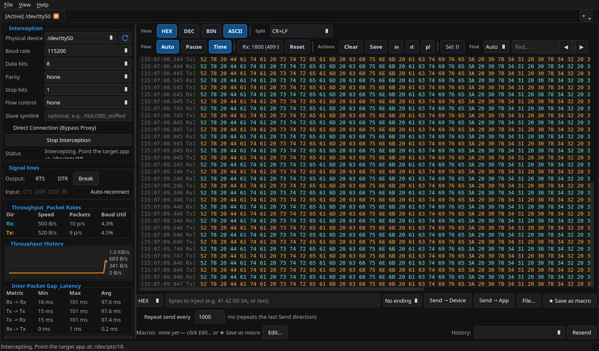
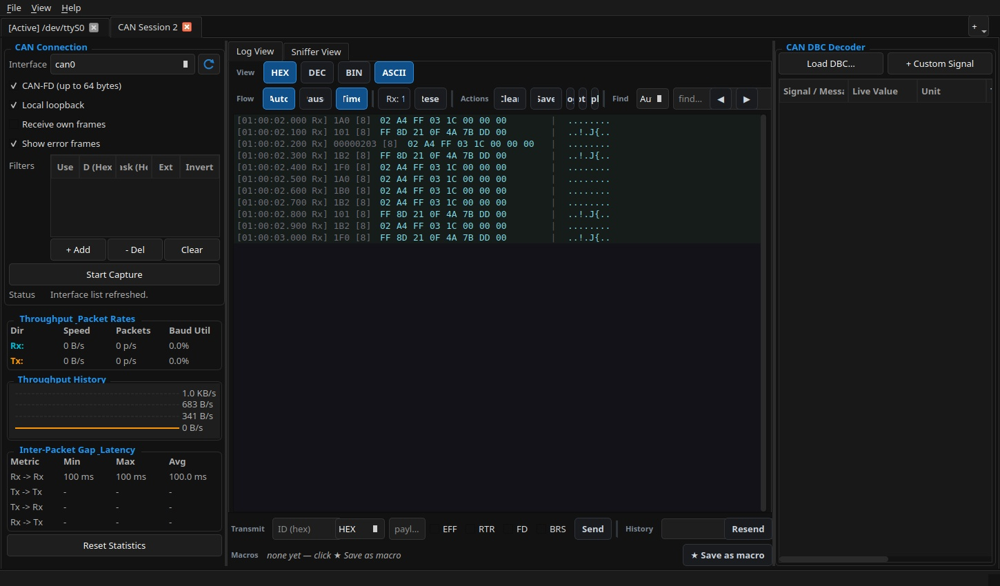
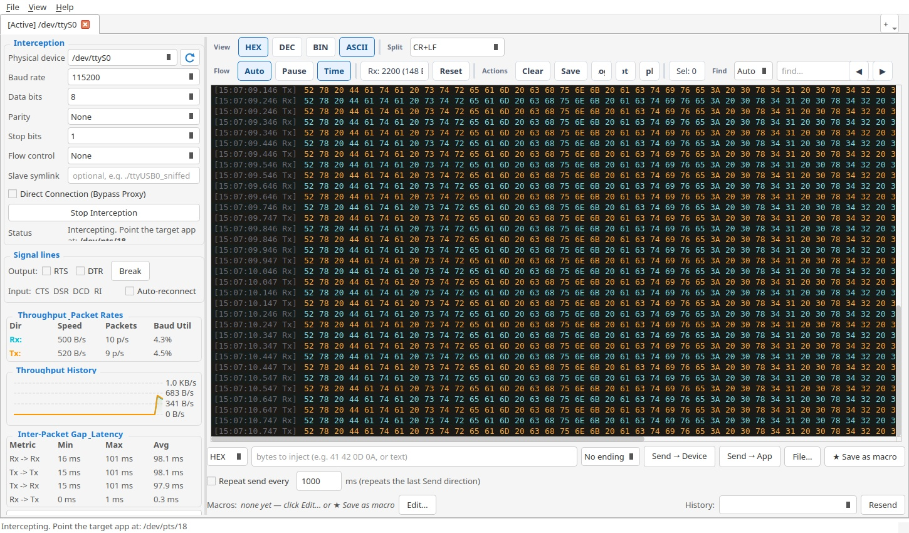
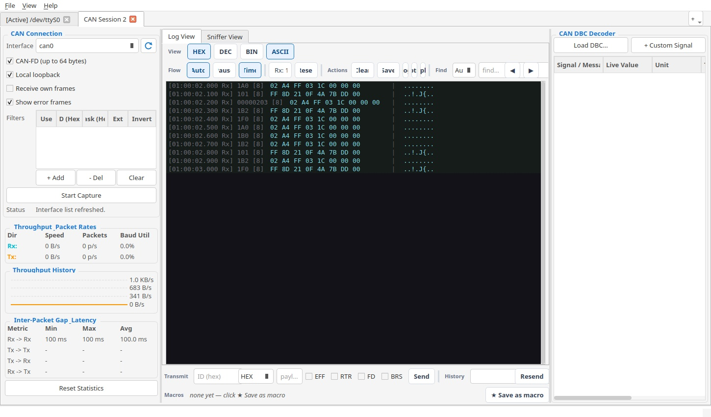

# AetherBus

[](https://github.com/beratatmaca/AetherBus/actions)
[](https://github.com/beratatmaca/AetherBus/actions)
[](https://codecov.io/gh/beratatmaca/AetherBus)
[](https://opensource.org/licenses/MIT)
[](https://en.cppreference.com/w/cpp/compiler_support/17)
[](https://www.qt.io/)
[](https://snapcraft.io/aetherbus)

**AetherBus** is a modern, ultra-lightweight diagnostic dashboard that bridges physical serial interfaces, SocketCAN buses, and Ethernet links into a unified multi-session control console.

Built in C++17 with Qt 6, it delivers high-performance monitoring and packet injection without freezing UI threads or dropping frames, even under megabaud traffic loads.

> [!NOTE]
> This application uses neutral terminology (e.g., *bridging*, *monitoring*, *viewing*, and *generating*) in its metadata to facilitate seamless integration and distribution on Linux platforms like the Snap Store.

---

## 📸 Previews

### Dark Theme

<p align="center">
  
  
</p>

### Light Theme

<p align="center">
  
  
</p>

---

## Quick Start

### 1. Install

* **Linux (Snap)**:

  ```bash
  sudo snap install aetherbus
  # Grant required hardware/network permissions:
  sudo snap connect aetherbus:serial-port
  sudo snap connect aetherbus:raw-usb
  sudo snap connect aetherbus:network-control
  sudo snap connect aetherbus:network-observe
  ```

* **Linux (Debian/Ubuntu)**: Download the `.deb` from [Releases](https://github.com/beratatmaca/AetherBus/releases).
* **macOS / Windows**: Install using the official `.dmg` or `.msi` packages from [Releases](https://github.com/beratatmaca/AetherBus/releases).

### 2. Run a Serial Session in 3 Steps

1. **Configure & Start**: Launch AetherBus, choose a physical device (e.g., `/dev/ttyUSB0` or `COM1`), configure the parameters, and click **Start Interception**. The virtual port path (e.g., `/dev/pts/5`) will appear in the status bar.
2. **Connect Client**: Point any target application (e.g., `minicom`, flasher, or test scripts) to this virtual port instead of the physical device.
3. **Analyze**: Watch live bidirectional traffic in the console, color-coded by direction (Rx/Tx), and use the injection panel to transmit custom data packets.

### 3. Quick-Launch Other sessions

* **SocketCAN**: File ➔ New CAN Session, choose your interface (e.g. `vcan0`), and click **Start Capture** to see live per-ID tables and DBC signal decoding.
* **Ethernet**: File ➔ New Ethernet Session, choose your network interface, and click **Start Capture** for real-time BPF-filtered traffic viewing.

---

## 🚀 Key Features

### 🔌 Serial Bridging & Diagnostics

* **Virtual Bridging**: Bridges a physical UART through a kernel pseudo-terminal (POSIX) or named pipe (Windows) so target clients communicate transparently.
* **Line-Setting Mirroring**: Dynamically matches baud/parity/framing changes made by the client app onto the physical device in real time.
* **Data Injection**: Send raw HEX, ASCII, DEC, or BIN payloads to either the device or application side, complete with persistent macros.
* **Hardware Controls**: Drive RTS/DTR signals, send serial breaks, and monitor CTS/DSR/DCD/RI status lines live.

### 🏎️ SocketCAN Bus Analysis (Linux)

* **Native CAN-FD**: Full classic CAN and CAN-FD monitoring/transmission via `PF_CAN` sockets.
* **Live per-ID Monitor**: Consolidated view showing one row per CAN ID with changed-byte highlighting and stale-row auto-dimming.
* **Hardware Filters**: Easily add ID + Mask filtering rules directly from the GUI.
* **DBC Signal Decoding**: Load `.dbc` files to translate raw CAN payloads into named signals and values in real time.

### 🌐 Ethernet Traffic Viewer & Generator

* **BPF-Filtered Captures**: Real-time packet viewing via `libpcap` using standard BPF filters (e.g. `port 80`, `udp`).
* **Wireshark-Style Layout**: A synchronized three-pane layout featuring a packet list, interactive protocol tree (Ethernet/IPv4/UDP/ICMP), and a raw hex/ASCII dump.
* **Packet Constructor**: Design and transmit customized Ethernet II / IPv4 frames with UDP or correctly-checksummed ICMP payloads on demand or at periodic intervals.
* **PCAP Replay**: Record sessions to standard `.pcap` files and replay them paced by their original packet timings.

### 📊 Common Diagnostics Suite

* **High-Performance Console**: Side-by-side HEX, ASCII, BINARY, and DECIMAL rendering optimized for low CPU overhead at megabaud rates.
* **Live Statistics**: Real-time throughput graphs, bandwidth utilization, inter-packet gap timing, and dropped-byte detection.
* **Data Inspector**: Instantly decode highlighted console bytes into Int8–64, float, double, binary, or ASCII representation.
* **Multi-Session Tabs**: Run multiple serial, CAN, and Ethernet interfaces concurrently in organized tabs.

---

## ⚙️ How It Works

AetherBus sits directly between your client application and the target hardware device, proxying data streams while keeping both ends completely in sync:

```text
                     ┌──────────────────────────────────┐
                     │        Target Application        │
                     │   (minicom, flasher, your app)   │
                     └──────────────┬───────────────────┘
                                    │  reads/writes /dev/pts/N
                                    ▼
    ┌─────────────────┐   poll()  ┌──────────────────────────┐
    │ Physical UART   │ ◀───────▶ │      AetherBus Proxy     │
    │ /dev/ttyUSB0    │   (Rx/Tx) │  PTY master ◀▶ slave pair│
    └─────────────────┘           └──────────────┬───────────┘
                                                 │  CapturedChunk queue
                                                 ▼
                                  ┌──────────────────────────┐
                                  │          Qt6 View        │
                                  │  HEX / ASCII / BIN / DEC │
                                  │   + byte injection panel │
                                  └──────────────────────────┘
```

---

## 🛠️ Compilation & Development

### Prerequisites

* **CMake** (v3.16+)
* **Qt6 SDK** (Core, Widgets, Network, Test)
* **C++17 Compiler** (GCC 10+, Clang 12+, MSVC 2019+)
* **libpcap-dev** (Linux/macOS; optional for Ethernet session capabilities)

### Build Instructions

```bash
# Clone the repository
git clone https://github.com/beratatmaca/AetherBus.git
cd AetherBus

# Configure and compile in Release mode
cmake -B build -DCMAKE_BUILD_TYPE=Release
cmake --build build -j$(nproc)

# Run tests (includes pseudo-terminal loopback verification)
cmake -B build -DBUILD_TESTING=ON
cmake --build build -j$(nproc)
ctest --test-dir build --output-on-failure
```

### Developer Controls

```bash
cmake --build build --target format        # Automatically format code using clang-format
cmake --build build --target tidy          # Execute static analysis using clang-tidy
cmake --build build --target docs          # Generate documentation via Doxygen
```

---

## ⚖️ License

AetherBus is open-source and released under the **MIT License**.

### Qt 6 and LGPL Compliance

This application links dynamically to the **Qt 6** framework, which is licensed under the **GNU Lesser General Public License (LGPL) v3**.

* In compliance with the LGPL v3, Qt libraries are dynamically loaded in precompiled releases.
* Qt source code can be obtained directly from [qt.io](https://www.qt.io/download).
* Users are permitted to modify the Qt libraries and relink AetherBus with their custom versions in accordance with LGPL v3 terms.
