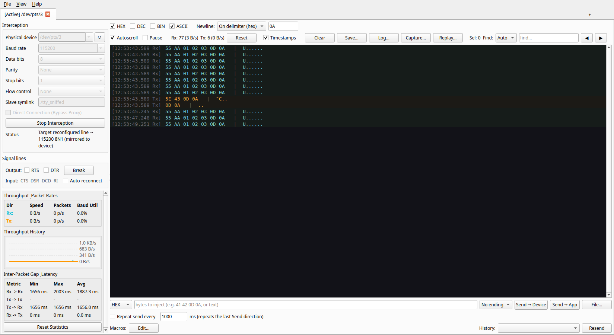

# AetherBus

[](https://github.com/beratatmaca/AetherBus/actions)
[](https://github.com/beratatmaca/AetherBus/actions)
[](https://codecov.io/gh/beratatmaca/AetherBus)
[](https://opensource.org/licenses/MIT)
[](https://en.cppreference.com/w/cpp/compiler_support/17)
[](https://www.qt.io/)

AetherBus is a modern, lightweight, open-source serial-port interceptor and protocol sniffer for Linux.

Written in C++17 and powered by the Qt 6 framework, it transparently proxies a physical UART through a kernel pseudo-terminal — letting an unmodified target application keep talking to the device while AetherBus captures, decodes, and lets you inject every byte in real time. It records to Wireshark-compatible pcap, replays captures offline, mirrors live line-setting changes onto the hardware, and reports throughput and timing statistics. Think `interceptty` wired to an `HTerm`-style diagnostic console, built for high-baud streams without dropping frames or stalling the UI.

## Screenshot



## How It Works

AetherBus sits transparently between your application and the hardware. It opens the real device, hands your application a virtual port (a pseudo-terminal), and shuttles every byte across while tagging its direction:

```text
                     ┌──────────────────────────────────┐
                     │        Target Application        │
                     │   (minicom, flasher, your app)   │
                     └──────────────┬───────────────────┘
                                    │  reads/writes /dev/pts/N
                                    ▼
   ┌─────────────────┐   poll()  ┌──────────────────────────┐
   │ Physical UART   │ ◀───────▶ │      AetherBus Proxy     │
   │ /dev/ttyUSB0    │   (Rx/Tx) │  PTY master ◀▶ slave pair│
   └─────────────────┘           └──────────────┬───────────┘
                                                 │  CapturedChunk queue
                                                 ▼
                                  ┌──────────────────────────┐
                                  │   Qt6 HTerm-style View   │
                                  │  HEX / ASCII / BIN / DEC │
                                  │   + byte injection panel │
                                  └──────────────────────────┘
```

## Features

* **Transparent interception** — proxies a real UART through a kernel PTY; the target app connects to a virtual port and never knows it is being watched.
* **Live line-setting mirroring** — when the target app reconfigures baud/parity/framing on the virtual port, AetherBus catches the change and applies it to the physical device automatically.
* **HTerm-style console** — simultaneous HEX / ASCII / BINARY / DECIMAL columns, colour-coded by direction, batch-rendered at 60 Hz with a rolling history so high-baud streams stay responsive.
* **Byte injection** — send crafted HEX / ASCII / DEC / BIN sequences (optional CR/LF endings, one-shot or repeating) to either the device or the application side, plus reusable macros and send history.
* **pcap capture & replay** — record traffic to a `LINKTYPE_RTAC_SERIAL` pcap that opens directly in Wireshark, and replay a capture back through the console offline with the original inter-packet timing.
* **Live statistics** — per-direction byte counts, throughput rates and chart, line utilisation, and inter-packet gap timing, plus dropped-byte accounting when a peer stops draining.
* **Signal control** — drive RTS/DTR, send a serial BREAK, and watch the CTS/DSR/DCD/RI modem lines update live.
* **Multi-session tabs** — intercept several links at once, each in its own tab.
* **Robust backend** — non-blocking per-direction write queues (a stalled peer can't wedge the other direction), RAII-clean teardown, and no silent write loss.

## Installation

AetherBus is distributed for Linux through the Snap Store and GitHub Releases.

### Snap Store (Linux)

[](https://snapcraft.io/aetherbus)

```bash
sudo snap install aetherbus
sudo snap connect aetherbus:serial-port   # grant access to /dev/tty* devices
sudo snap connect aetherbus:raw-usb       # grant access to USB-serial adapters
```

### GitHub Releases (Linux, macOS, Windows)

Pre-compiled packages are available on the [GitHub Releases Page](https://github.com/beratatmaca/AetherBus/releases):

* **Linux**: Download the `.deb` package (Debian/Ubuntu-based systems).
* **Windows**: Download the `.msi` installer.
* **macOS**: Download the `.dmg` package.

> **Note:** Live serial interception relies on POSIX pseudo-terminals and is a Linux feature. On macOS and Windows the GUI and format tooling build and run, but the interception backend is compiled only on UNIX hosts.

## The Console

Captured traffic streams into a colour-coded, monospaced viewport, rendered side-by-side as the selected format plus an ASCII gutter, exactly like a hardware terminal:

```text
[14:23:01.004 Tx]  41 42 43 0D 0A    |  ABC..
[14:23:01.012 Rx]  06 3F 21          |  .?!
```

Toggle the display between **HEX**, **ASCII**, **BINARY**, and **DECIMAL** at any time — the columns render side by side and can be combined. The view is batch-rendered at 60 Hz and capped to a rolling history so even 921600-baud streams stay responsive, with autoscroll, pause, timestamp toggle, and in-buffer search. Alongside the console, a stats panel shows live throughput, utilisation, and gap timing, and you can arm a **Capture…** to a pcap file or **Replay…** a previous capture back through the same view. A premium dark theme ships in [`assets/theme.qss`](assets/theme.qss) and is loaded at startup.

## Technical Architecture

The architecture separates the interception engine from the presentation layer: the backend (`aether_core`) compiles as a static library with **zero graphical dependencies** and is unit-tested in isolation.

**Core (`src/core/`)**

* **`format_codec`**: A pure, side-effect-free conversion layer (bytes ⇄ HEX / ASCII / BINARY / DECIMAL) and the injection-field parsers.
* **`PtyProxy`**: Opens the physical UART in raw mode via `termios`, allocates a master/slave pseudo-terminal pair (`posix_openpt` / `grantpt` / `unlockpt` / `ptsname`), and runs a background `poll()` multiplexing loop. UART bytes are tagged **Rx** and forwarded to the PTY master; target-app bytes are tagged **Tx** and forwarded to the UART — over non-blocking, per-direction write queues so one stalled side can't wedge the other. It mirrors slave-side line-setting changes onto the device, tracks byte/drop counters, and can capture to pcap, emitting every chunk to the GUI over thread-safe queued signals. Teardown is RAII-clean via a self-pipe wake and symlink unlink.
* **`linux_baud`**: Arbitrary (non-standard) baud rates via the Linux `termios2` path, isolated from `<termios.h>`.
* **`stats_calculator`**: Throughput rates, line utilisation, and inter-packet gap statistics from the captured chunk stream.
* **`capture_replay`**: Parses the `LINKTYPE_RTAC_SERIAL` pcap files `PtyProxy` writes and replays them as `CapturedChunk`s with the original timing.
* **`signal_cleanup`**: Releases descriptors and symlinks on fatal signals so a crash can't leave `/dev/ttyUSB0` locked.

**GUI (`src/gui/`)** — Qt 6 Widgets front end that only ever consumes `CapturedChunk` signals and never touches a raw descriptor:

* **`MainWindow`** hosts multiple **`SessionWidget`** tabs. Each session owns one `PtyProxy` and composes dedicated panels — **`ConfigPanel`** (device & line settings), **`SignalPanel`** (RTS/DTR/BREAK + modem-line LEDs), **`InjectionPanel`** (byte injection), **`StatsPanel`** + **`ThroughputChart`** (live metrics), **`MacroBar`** (macros & history) — around the **`ConsoleView`** (rendering + search), themed by **`ThemeController`**.

---

## Getting Started

### Prerequisites

To build AetherBus, you will need:

* **CMake** (v3.16 or higher)
* **Qt6 SDK** (the `Core`, `Widgets`, and `Network` modules; `Test` is also needed to build the test suite)
* **C++17 compliant compiler** (GCC 10+, Clang 12+, or MSVC 2019+)

### Build Instructions

To compile the project:

```bash
# Clone the repository
git clone https://github.com/beratatmaca/AetherBus.git
cd AetherBus

# Configure and compile (Release mode)
cmake -B build -DCMAKE_BUILD_TYPE=Release
cmake --build build -j$(nproc)
```

To run the unit + integration test suite (includes a live pseudo-terminal loopback):

```bash
cmake -B build -DBUILD_TESTING=ON
cmake --build build -j$(nproc)
ctest --test-dir build --output-on-failure
```

### Developer Tooling

The build provides helper targets for formatting, linting, and documentation:

```bash
cmake --build build --target format        # apply clang-format in place
cmake --build build --target format-check  # verify formatting (CI-safe)
cmake --build build --target tidy          # run clang-tidy static analysis
cmake --build build --target docs          # generate Doxygen HTML
```

---

## Versioning

AetherBus uses an **auto-incrementing version** of the form `MAJOR.MINOR.PATCH.BUILD`:

* **`MAJOR.MINOR.PATCH`** — the semantic base, kept in the top-level [`VERSION`](VERSION) file. Bump it by hand for meaningful releases. Notable changes per version are recorded in [`CHANGELOG.md`](CHANGELOG.md).
* **`BUILD`** — the git commit count (`git rev-list --count HEAD`), which increases automatically with every commit/merge to `main`, so each build gets a unique, monotonically increasing version with no manual edits.

The version is the single source of truth across the whole project:

| Surface                             | How it gets the version                              |
| ----------------------------------- | ---------------------------------------------------- |
| CMake (`PROJECT_VERSION`)           | `cmake/Version.cmake` resolves it before `project()` |
| The binary (`aether/version.h`)     | generated header (e.g. `AETHER_VERSION_STRING`)      |
| Packages (`.deb` / `.msi` / `.dmg`) | CPack uses the same full version in filenames        |
| Snap                                | `snapcraft.yaml` derives it in `override-pull`       |
| GitHub release page                 | the `version` job in `release.yml`                   |

CMake derives the build number from git automatically. CI passes the exact
values in so every matrix runner agrees:

```bash
cmake -B build -DAETHER_BUILD_NUMBER=42 -DAETHER_GIT_SHA=1a2b3c4
```

### Releases

The release pipeline ([`release.yml`](.github/workflows/release.yml)) computes the version once and shares it with every build job and the release page:

* **Push to `main`** → packages are built for Linux/macOS/Windows and published to the rolling **`latest`** pre-release, whose name and notes show the current incrementing version (e.g. *AetherBus v0.1.0.42 (latest main)*).
* **Push a `vX.Y.Z` tag** → a normal (non-pre-release) GitHub Release named after the tag. To cut one, set `VERSION` to `X.Y.Z`, commit, then:

  ```bash
  git tag v0.2.0 && git push origin v0.2.0
  ```

---

## Usage Reference

Launch AetherBus and intercept a live serial link in four steps:

1. **Select the device.** Pick the physical port (e.g. `/dev/ttyUSB0`) from the scanned list and set the line parameters — baud rate, data bits, parity, and stop bits — to match the hardware.
2. **Start interception.** Click **Start Interception**. AetherBus opens the UART, spins up the proxy loop, and reports the kernel-assigned virtual port (e.g. `/dev/pts/5`) in the status bar. Optionally provide a stable symlink (e.g. `./ttyUSB0_sniffed`) so the target app always finds the same path.
3. **Point your application at the virtual port.** Connect your existing tool — `minicom`, a firmware flasher, or your own software — to the reported slave path instead of the real device. All traffic now flows through AetherBus and appears live in the console, colour-coded by direction.
4. **Decode and inject.** Switch the console format on the fly, and use the injection panel to send crafted bytes — as space-separated HEX (`41 42 0D 0A`), ASCII, decimal, or binary, with an optional CR/LF ending and one-shot or repeating delivery — directly to either the **device** or the **application** side of the link. Save frequently-used payloads as macros.
5. **Capture and replay.** Arm **Capture…** to record everything to a `LINKTYPE_RTAC_SERIAL` pcap (open it in Wireshark), or **Replay…** a previous capture back through the console for offline analysis with the original timing preserved.

#### Example: sniffing a modem session with `minicom`

```bash
# Terminal 1 — start AetherBus, intercept /dev/ttyUSB0 at 115200 8N1.
# The status bar reports e.g. /dev/pts/5.

# Terminal 2 — point minicom at the virtual port instead of the hardware.
minicom -D /dev/pts/5
```

Every command minicom sends and every reply the modem returns is now mirrored, timestamped, and decoded in the AetherBus console.

---

## License

This project is open-source and available under the MIT License.

### Third-Party Software & LGPL Compliance

AetherBus links to the **Qt 6** framework, which is licensed under the **GNU Lesser General Public License (LGPL) v3**.

In compliance with the LGPL v3:

* In precompiled releases, the Qt libraries are linked dynamically.
* You can obtain the Qt source code at [qt.io/download](https://www.qt.io/download).
* You are permitted to modify the Qt libraries and relink this application with your modified version, in accordance with the terms of the LGPL v3.
